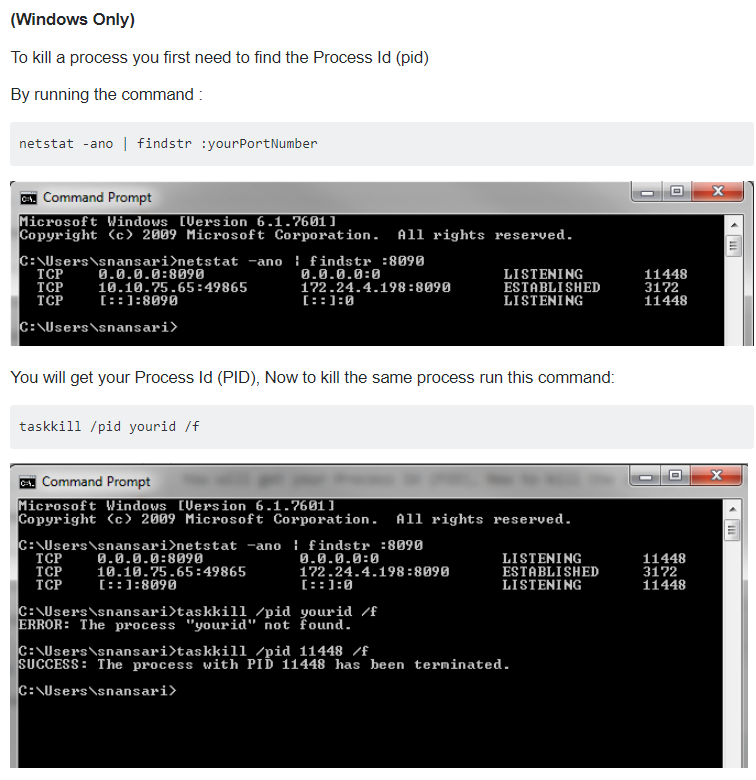

If you start Spring Boot and: 
 
***************************
APPLICATION FAILED TO START
***************************
with

org.apache.catalina.LifecycleException: Protocol handler start failed

Caused by: java.net.BindException: Address already in use: bind

#Solution

write in cmd:

netstat -ano | findstr :yourPortNumber

taskkill /pid yourid /f

Example:

netstat -ano | findstr :8080

taskkill /pid 9824 /f

